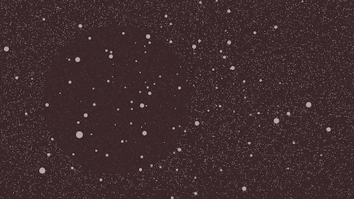
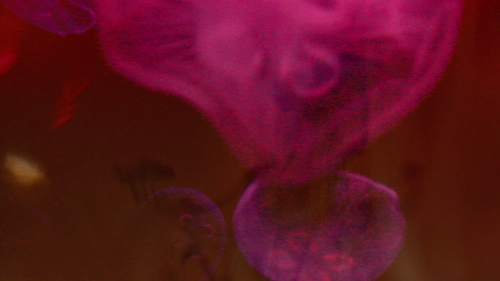
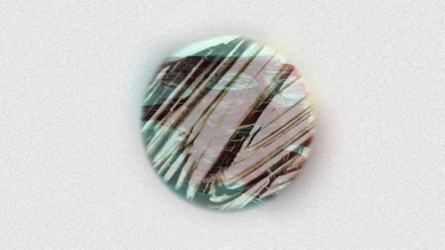

#Midterm

"Particles Void"

Staying true to the works I have done in the past, I replicated elements of texutres and shapes in my midterm. When I am creating films, I often like to add many layers and simulate different textures and movements. In "Particles Void", I created a particle system as the base layer to give it action in the background. Next I added a semi-opaque circle to give an illusion of depth. On the top layer, I added a boids-flocking system for an extra layer of movement.

When I was debugging this code, I figured out that you could actually zoom in and out of the screen allowing different effects from the "boids". In the future, I could see myself using this piece that I have created to create a similar virtual environment.

When choosing a color theme for any piece I do, I will usually go with a warm color palette. I find warm colors to be more attractive and inviting. For this piece, I decided to go with a darker more muted red because I felt like the particles and boids were able to stand out more against this background.

###Halcyon

###Celestial

Sound:
Microtonal by SUNE
soundcloud.com/sunemusic
soundcloud.com/lindred