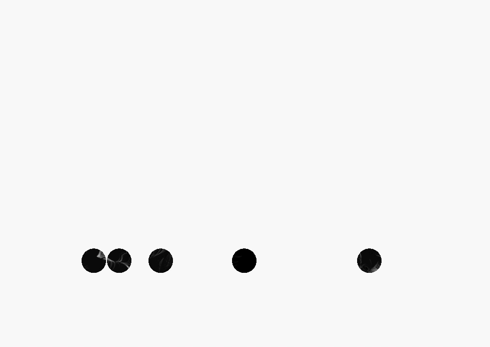

##Final Concept

For the final, I am proposing to make a animated simulation utilizing Perlin Noise and Particle Systems. The imagery I am creating is purely for aesthetic purposes. I want to create an image that is both abstract and beautiful. Then, I want to use alpha masking to mask out particular sections of the animation so that the viewer can only see certain parts of the animation, as if staring through a peephole. The peepholes are symbolically how we as individuals go through life. We, as individuals in society, go through our daily lives without seeing the whole picture. By looking at life through peepholes of our own, we sometimes miss the beauty in life. The peepholes in the simulation will only be able to capture the beauty of the animation if there are things happening in that area in that particular moment. By focusing the mask on a fixed positions, the viewer will only be able to catch fleeting beautiful moments in the simulation.

